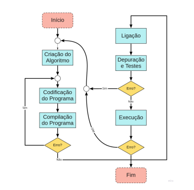

# 1ª Avaliação
# Laboratório de Algoritmos e Estruturas de Dados 2

Este repositório é para a 1ª avaliação da disciplina <strong>Laboratório de Algoritmos e Estruturas de Dados 2<strong>.

## Instruções da Avaliação

* Todas as 10 questões deverão ser resolvidas;
* Os códigos deverão estar no GITHUB e o link com os algoritmos deverá ser enviado até o dia 4 de março;
* Deverão ser utilizados o GDB para mostrar o código funcionando;

## Organização

A resolução e o código das questões da lista, estão na pasta principal com o nome correspondente a cada questão. Por exemplo: questao-01, questao-02, etc.

## Método de Resolução

Para a resolução de todas as questões dessa lista foi utilizando a metodologia apresentada no diagrama da figura abaixo:

## Lista

1. Uma aplicação interessante de computadores é desenhar gráficos e gráficos de barras. Escreva um programa que leia cinco números (cada um entre 1 e 30). Para cada número lido, o seu programa deve imprimir uma linha contendo aquele número de asteriscos adjacentes. Por exemplo, se o seu programa lê o número sete, ele deve imprimir *******.

2. Escreva um programa para converter e imprimir os caracteres para os valores ASCII de 0 a 127. O programa deve imprimir 10 caracteres por linha.

3. Um triângulo retângulo pode ter lados inteiros. O conjunto de três valores inteiros para os lados de um triângulo retângulo é chamado de triplo pitagórico. Esses três lados devem satisfazer a relação de que a soma dos quadrados de dois dos lados é igual ao quadrado da hipotenusa. Encontre todos os triplos pitagóricos para cateto1, cateto2 e a hipotenusa, todos com até o valor de n, indicado como parâmetro.

4. Escreva um programa que imprima uma tabela de todos os equivalentes de algarismos romanos dos números decimais no intervalo de 1 a 100.

5. Escreva dois programas que recebem como parâmetro três inteiros representando os coeficientes de uma função do segundo grau e execute:
 (a) O teste para saber se essa função tem raízes reais;
 (b) O valor das raízes reais.

6. Escreva uma função recusiva para calcular o Máximo Divisor de dois números inteiros.

7. Escreva uma função recursiva para calcular a função isPrime(n) que retorna 1 caso n for primo e 0 caso n não for primo.

8. Escreva uma função que recebe como entrada um valor inteiro e retorna outro inteiro com os valores revertidos. Por exemplo:
  f(1234) = 4321

9. Defina uma função recursiva que dados os valores de x1 e x2 retorne exatamente y = x1 x2

10. Implemente a função recursiva a seguir definida por A(m, n) definido recursivamente da seguinte forma:
 (a) n + 1, se m = 0;
 (b) A(m − 1, 1), se m > 0, n = 0;
 (c) A(m − 1, A(m, n − 1)), se m > 0 e n > 0
* Crie uma fun¸c˜ao auxiliar que recebe dois inteiros a e b e apresenta todos os resultados para A(x, y)
de forma que x < a e y < b.
